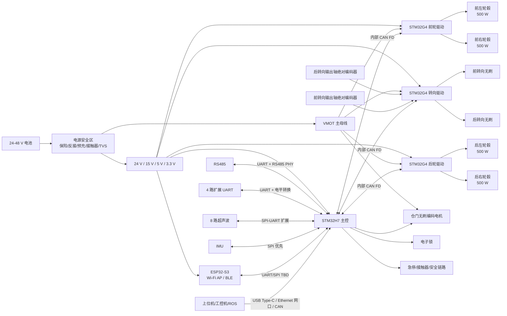
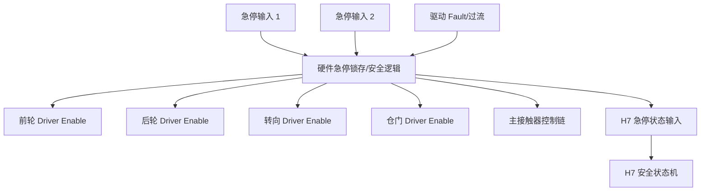
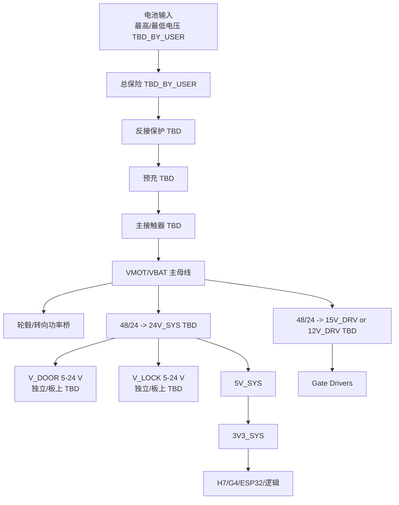
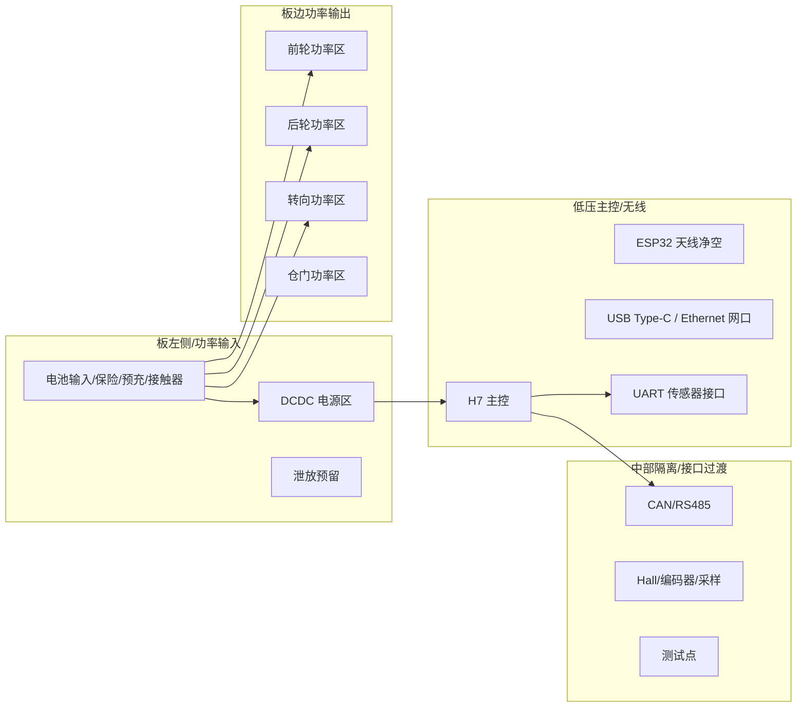

# 系统图与 EasyEDA 落图计划

## 1. 系统框图

## 2. 安全链路框图

要求：

- `LATCH` 不能只由 H7 软件实现。
- H7 可以读取状态和执行复位流程，但不能是急停关断的唯一执行者。
- 复位策略待用户确认。

## 3. 电源树

## 4. EasyEDA 原理图页面拆分

### 4.1 页面清单

| 页码 | 页面名 | 可以先画吗 | 卡点 |
|---:|---|---|---|
| 01 | System_Block | 可以 | 无 |
| 02 | Power_Input_Safety | 部分可以 | 电池最高电压、总电流、接触器、预充 |
| 03 | Power_Rails | 部分可以 | 每路电流预算 |
| 04 | STM32H7_Main | 部分可以 | H7 具体型号/封装 |
| 05 | H7_Comm_USB_TypeC_ETH_CAN_RS485 | 部分可以 | Ethernet PHY/RJ45、Type-C 供电与屏蔽、隔离策略 |
| 06 | ESP32_S3_Wireless | 可以 | 天线版本取决于外壳 |
| 07 | UART_Sensor_Expansion | 部分可以 | UART 模块波特率、电平、供电电流 |
| 08 | G4_Front_Dual_FOC | 部分可以 | G4 型号、轮毂峰值电流、Gate Driver/MOS |
| 09 | G4_Rear_Dual_FOC | 复用前轮页 | 同前轮 |
| 10 | G4_Steer_Dual_FOC | 部分可以 | 转向电机、编码器、限位 |
| 11 | Door_Motor_Driver | 部分可以 | 仓门电机和编码器 |
| 12 | Lock_Driver | 部分可以 | 锁类型和电流 |
| 13 | Safety_Chain | 部分可以 | 急停复位策略 |
| 14 | Connectors_Testpoints | 部分可以 | 连接器系列、板框 |

### 4.2 推荐画图顺序

1. 先画 `System_Block`，只放框图和页间说明。
2. 画 `STM32H7_Main` 的最小系统，但具体引脚等封装确认后再锁定。
3. 画 `G4_Front_Dual_FOC` 模板，先只到功能块级别。
4. 复制成后轮页，保持命名差异。
5. 画转向页，增加输出轴编码器和限位。
6. 画通信页：CAN/RS485/USB Type-C/Ethernet 网口。
7. 画 UART 扩展页。
8. 等电流参数确认后画功率桥、采样、MOS、驱动器。
9. 等电源参数确认后画电源安全和 DCDC。
10. 最后画连接器汇总和测试点。

## 5. EasyEDA 项目结构建议

建议项目名：

- `Delivery_Robot_Chassis_Controller`

建议文档：

| 类型 | 名称 |
|---|---|
| Schematic | `SCH_Main_Controller` |
| Schematic | `SCH_Power_Safety` |
| Schematic | `SCH_Motor_Drives` |
| Schematic | `SCH_Interfaces` |
| PCB | `PCB_Chassis_Controller_Mainboard` |

如果 EasyEDA 项目只用一个多页原理图，也可以统一为：

- `Delivery_Robot_Chassis_Controller.SchDoc`
- `Delivery_Robot_Chassis_Controller.PcbDoc`

## 6. 网类建议

| Net Class | 用途 | 约束状态 |
|---|---|---|
| `PWR_VBAT_HIGH_CURRENT` | 电池/轮毂/转向主功率 | 宽度 TBD_BY_USER |
| `PWR_24V` | 24 V 电源 | 宽度 TBD |
| `PWR_15V_DRV` | Gate Driver 电源 | 宽度 TBD |
| `PWR_5V` | 5 V 电源 | 宽度 TBD |
| `PWR_3V3` | 3.3 V 逻辑 | 宽度 TBD |
| `PHASE_MOTOR` | U/V/W 三相输出 | 宽度 TBD_BY_USER |
| `CURRENT_SENSE` | 电流采样 | Kelvin/短/远离开关节点 |
| `CAN_DIFF` | CAN 差分 | 阻抗/长度 TBD |
| `USB_TYPEC_DIFF` | USB Type-C D+/D- 差分 | 阻抗 TBD，ESD 靠近连接器 |
| `ETH_DIFF` | Ethernet PHY 到 RJ45/磁性器件差分 | 阻抗 TBD |
| `ENCODER_SPI` | 编码器 SPI | 串阻/ESD/远离功率 |
| `UART_EXT` | 外部 UART | 电平转换/ESD |

## 7. PCB 大致分区草案

说明：

- 这只是布局意图，不是最终板框。
- 最终分区必须由板尺寸、安装孔、电机线出口、散热器决定。

## 8. 进入 EasyEDA 前我还需要

最少需要：

- 板框尺寸。
- 层数和铜厚。
- 电机峰值电流。
- H7/G4 具体封装倾向。
- 连接器系列。
- 电池最高电压。
- 散热方式。
