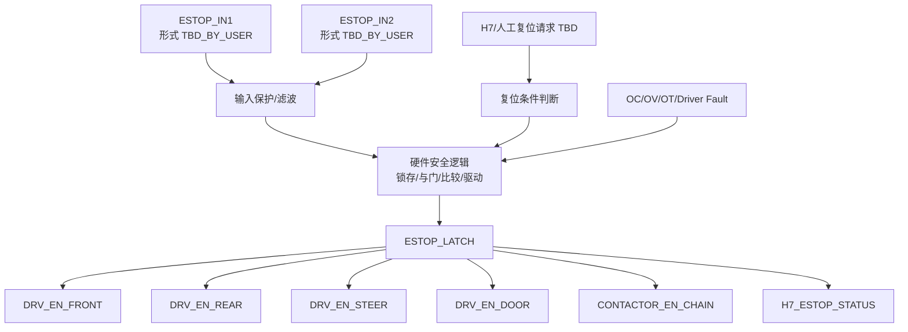
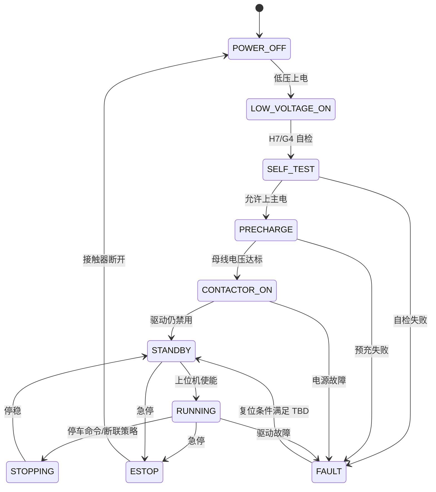

# 急停与安全链路详细约束

## 1. 目标

本文件把急停、驱动使能、Fault 锁存、主接触器、预充和软件状态机之间的关系拆清楚。

重要边界：

- 这不是功能安全认证设计。
- 这不是 ISO 13849、IEC 61508、ISO 26262 认证文件。
- 本项目当前目标是工程样机级硬件安全闭环。
- 若后续产品化，需要专门做安全等级评估和第三方认证路线。

## 2. 原始硬要求

| ID | 要求 |
|---|---|
| SAF-001 | 急停不能只进 MCU |
| SAF-002 | 急停必须硬件关断 |
| SAF-003 | 急停输入同时进入 H7 做状态判断 |
| SAF-004 | 急停同时拉低所有驱动区 Enable |
| SAF-005 | 急停同时控制主接触器断开 |
| SAF-006 | 所有驱动区急停后关闭 PWM |
| SAF-007 | 上电默认不使能 |
| SAF-008 | Fault 需要锁存 |

## 3. 安全链路建议拓扑

## 4. 输入形式待确认

急停输入有几种常见方案，但不能在未确认实物前写死。

| 方案 | 特点 | 风险/备注 |
|---|---|---|
| 双通道常闭 NC | 断线也能触发，工程上更安全 | 需要确认急停按钮/线束支持 |
| 双通道常开 NO | 接线简单 | 断线不一定能检测，安全性较弱 |
| 单通道 NC | 比 NO 好，但冗余低 | 与原始“双输入”需求不完全匹配 |
| 外部安全继电器输出 | 板子接收安全继电器结果 | 成本/体积增加，但安全边界更清楚 |

当前建议：

- 优先考虑双通道常闭 NC。
- 但最终必须由用户确认急停按钮、线束、整车安全架构。

## 5. 输出关断对象

| 输出 | 目标 | 默认态 | 急停态 | 说明 |
|---|---|---|---|---|
| `DRV_EN_FRONT` | 前轮驱动区 | Disabled | Disabled | 硬件链路直接控制 |
| `DRV_EN_REAR` | 后轮驱动区 | Disabled | Disabled | 硬件链路直接控制 |
| `DRV_EN_STEER` | 转向驱动区 | Disabled | Disabled | 硬件链路直接控制 |
| `DRV_EN_DOOR` | 仓门驱动区 | Disabled | Disabled | 仓门也必须关断 |
| `CONTACTOR_EN_CHAIN` | 主接触器控制链 | Off | Off | 是否直接断线圈电源待定 |
| `H7_ESTOP_STATUS` | H7 输入 | Read only | Active | H7 只读状态 |

## 6. Fault 源

### 6.1 必须进入 H7 的 Fault

| Fault | 来源 |
|---|---|
| `FAULT_FRONT` | 前轮 G4/驱动器 |
| `FAULT_REAR` | 后轮 G4/驱动器 |
| `FAULT_STEER` | 转向 G4/驱动器 |
| `FAULT_DOOR` | 仓门驱动器 |
| `FAULT_POWER` | 电源安全区 |
| `FAULT_LOCK` | 电子锁过流/状态异常 |

### 6.2 建议进入硬件关断链的 Fault

| Fault | 是否建议硬件关断 | 说明 |
|---|---|---|
| 过流 | 是 | 必须快速关断 |
| Gate Driver Fault | 是 | 驱动器本地 Fault 应直接关断 |
| 母线严重过压 | 是 | 具体阈值待定 |
| 急停 | 是 | 原始硬要求 |
| 过温 | 可选 | 可先软件降额，严重过温硬件关断 |
| CAN 超时 | 软件为主 | G4 本地进入安全状态 |
| 编码器异常 | 软件为主 | 转向场景可能需要硬件禁用策略 |

## 7. 锁存与复位

### 7.1 必须明确的状态

| 状态 | 含义 | 能否自动恢复 |
|---|---|---|
| `ESTOP_LATCHED` | 急停触发并锁存 | TBD_BY_USER |
| `FAULT_LATCHED` | 硬件或软件故障锁存 | TBD_BY_USER |
| `POWER_FAULT` | 电源异常 | TBD_BY_USER |
| `CAN_TIMEOUT` | 通信超时 | TBD_BY_USER |

### 7.2 推荐复位条件

建议复位需要同时满足：

- 急停输入已恢复。
- 主控确认所有驱动命令为禁用。
- 上位机或人工复位动作存在。
- 关键电源电压正常。
- 所有 Gate Driver Fault 已释放。
- H7 状态机处于允许复位状态。

不能自动做的事：

- 急停按钮刚弹起就自动重新使能驱动。
- MCU 复位后默认打开驱动。
- 上位机断联恢复后立即恢复运行。

## 8. 与主接触器/预充的关系

## 9. 原理图实现约束

### 9.1 输入保护

急停输入建议包含：

- 反接/浪涌保护。
- RC 滤波。
- ESD。
- 上拉/下拉明确。
- 断线检测，若使用 NC 双通道。
- 输入状态同时送硬件逻辑和 H7。

### 9.2 输出驱动

驱动 Enable 输出建议：

- 默认下拉为禁用。
- H7 复位期间保持禁用。
- 急停硬件逻辑能覆盖 H7 使能请求。
- 对每个驱动区最好有 Enable 回读或 Fault 回读。

### 9.3 接触器控制

接触器线圈驱动建议：

- MOSFET 或专用低边驱动。
- 续流二极管/TVS，释放速度按接触器要求设计。
- 线圈电流检测可选。
- 辅助触点反馈建议预留。

### 9.4 预充控制

预充建议包含：

- 预充开关。
- 预充电阻。
- 母线电压检测。
- 预充超时。
- 预充失败 Fault。

参数待定：

- 母线电容总量。
- 目标预充时间。
- 预充电阻功率。
- 预充开关耐压/电流。

## 10. 验证项目

| 测试 | 通过标准 |
|---|---|
| H7 不上电，急停触发 | 驱动 Enable 不会打开 |
| H7 复位中 | 所有驱动保持禁用 |
| 急停触发 | 所有 Enable 拉低，接触器控制断开 |
| 急停解除 | 不自动重新进入 RUNNING，除非用户确认允许 |
| 单个驱动 Fault | 对应驱动禁用，H7 记录 Fault |
| 过流硬件比较器触发 | PWM/Driver 直接关断 |
| CAN 超时 | G4 本地进入安全状态 |
| 接触器反馈异常 | H7 进入 Fault |

## 11. 需要用户立刻确认

1. 急停按钮/输入是常闭 NC 还是常开 NO？
2. 急停有几个物理按钮？线束多长？
3. 急停解除后是否必须人工复位？
4. 主接触器是板外还是板上？
5. 主接触器线圈电压和电流是多少？
6. 是否已有外部安全继电器？
7. CAN 超时时，轮毂是自由滑行、缓停、主动刹车还是短三相？
