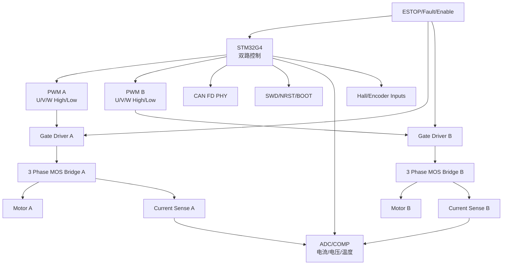
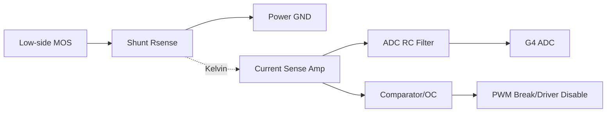

# 电机驱动原理图页模板

## 1. 适用范围

本模板适用于：

- 前轮双轮毂 FOC 页。
- 后轮双轮毂 FOC 页。
- 双转向 FOC 页。
- 仓门 BLDC 驱动页的部分结构。

区别：

| 驱动页 | 电机数量 | 闭环主反馈 | 控制目标 |
|---|---:|---|---|
| 前轮 | 2 | Hall，编码器预留 | 速度/力矩 |
| 后轮 | 2 | Hall，编码器预留 | 速度/力矩 |
| 转向 | 2 | 输出轴绝对编码器 | 位置 |
| 仓门 | 1 | ABI/SPI/限位 TBD | 位置/速度/动作 |

## 2. 双 FOC 页结构

## 3. 每个电机通道必备子电路

| 子电路 | 必须/可选 | 说明 |
|---|---|---|
| 三相 MOS 半桥 | 必须 | U/V/W 三相输出 |
| 三相 Gate Driver | 必须 | 高低侧驱动、保护、Fault |
| 电流采样 | 必须 | 三低边或三相采样 |
| 硬件过流关断 | 必须 | 软件 ADC 不能替代 |
| 母线电压采样 | 必须 | 每个驱动区至少 1 路 |
| 温度采样 | 必须 | MOS/板温，电机温度可选 |
| Hall 输入 | 轮毂必须 | 5 V Hall 需保护和电平处理 |
| ABI 编码器 | 轮毂建议预留 | A/B/Z |
| SPI 绝对编码器 | 转向必须 | 输出轴反馈 |
| Driver Enable | 必须 | 受急停硬件链路控制 |
| Driver Fault | 必须 | 回读 G4/H7 |
| SWD | 必须 | 每个 G4 独立调试 |

## 4. Gate Driver 接口信号

每个三相驱动器至少需要：

| 信号 | 方向 | 说明 |
|---|---|---|
| `PWM_UH` | G4 -> Driver | U 相高侧 |
| `PWM_UL` | G4 -> Driver | U 相低侧 |
| `PWM_VH` | G4 -> Driver | V 相高侧 |
| `PWM_VL` | G4 -> Driver | V 相低侧 |
| `PWM_WH` | G4 -> Driver | W 相高侧 |
| `PWM_WL` | G4 -> Driver | W 相低侧 |
| `DRV_EN` | Safety/G4 -> Driver | 使能，硬件链路优先 |
| `DRV_FAULT` | Driver -> G4/H7 | 故障输出 |
| `OC_TRIP` | Sense/Driver -> G4 Break | 过流硬件关断 |
| `nSLEEP`/`ENABLE` | G4/Safety -> Driver | 具体名称随芯片 |
| `SPI_CFG` | G4 <-> Driver | 若驱动器需要 SPI 配置 |

注意：

- 如果 Gate Driver 需要 SPI 配置，G4 资源要额外预算。
- 如果 Gate Driver 自带电流放大器，需核对输入范围和增益。

## 5. 电流采样模板

### 5.1 三低边采样

设计公式：

- `V_SHUNT_PEAK = I_PHASE_PEAK * R_SHUNT`
- `P_SHUNT_RMS = I_SHUNT_RMS^2 * R_SHUNT`
- `GAIN <= V_ADC_RANGE / V_SHUNT_PEAK`
- `OC_THRESHOLD = I_HW_TRIP * R_SHUNT * GAIN`

不能现在定的量：

- `I_PHASE_PEAK`
- `I_SHUNT_RMS`
- `R_SHUNT`
- 放大器增益。
- 硬件过流阈值。

### 5.2 三相采样

适合更高性能，但成本/面积更高。

需要确认：

- 相线电流采样是否使用霍尔/磁隔离/高边放大器。
- 共模范围。
- 带宽。
- 成本和板面积。

### 5.3 不推荐作为主方案

单母线采样不作为首版 FOC 主方案，原因：

- 原始需求明确不建议。
- 双 FOC 场景采样窗口更复杂。
- 低速/高调制/多电机同时工作时算法和硬件压力更大。

## 6. 母线电压采样

每个驱动区至少 1 路：

| 项目 | 说明 |
|---|---|
| 输入 | `VMOT` |
| 输出 | `ADC_VBUS_x` |
| 分压耐压 | 按电池最高电压 + 瞬态余量 |
| 滤波 | RC 低通 |
| 保护 | ADC 钳位/串阻 |
| 校准 | 固件参数 |

待确认：

- 电池最高电压。
- 过压保护阈值。
- 欠压保护阈值。

## 7. 温度采样

每个功率区建议：

- 每个三相桥至少 1 个 NTC。
- 每个双驱动区至少 2 个温度点。
- DCDC/Gate Driver 可视热风险加测温。

信号：

- `TEMP_MOS_A`
- `TEMP_MOS_B`
- `TEMP_BOARD_x`

## 8. Hall 输入模板

每个轮毂：

| 信号 | 保护 |
|---|---|
| `5V_HALL` | 限流/滤波 |
| `HALL_A` | ESD、串阻、RC、上拉/下拉 |
| `HALL_B` | ESD、串阻、RC、上拉/下拉 |
| `HALL_C` | ESD、串阻、RC、上拉/下拉 |
| `AUX_TEMP_SPEED` | 类型待确认后决定 |

关键待定：

- Hall 输出是开漏还是推挽。
- Hall 供电是否必须 5 V。
- G4 输入是否直接耐受，通常不应假设 5 V 直连。

## 9. 转向输出轴编码器

转向闭环主反馈：

- `J_STEER_ANGLE_F`
- `J_STEER_ANGLE_R`

必须进入转向 G4。

每路建议：

- 独立 CS。
- SCK/MISO/MOSI 串联电阻。
- DRDY/ERR 可选。
- 3.3 V 编码器电源滤波。
- ESD。
- 屏蔽/地策略待定。

待确认：

- 编码器型号。
- SPI 模式。
- 最大时钟频率。
- 分辨率。
- 零位校准方式。

## 10. 双 FOC G4 资源风险检查

每个双 FOC G4 需要同时满足：

| 资源 | 前/后轮 | 转向 | 风险 |
|---|---:|---:|---|
| 互补 PWM | 12 路 | 12 路 | 高 |
| PWM Break | 至少 2 路或共享 | 至少 2 路或共享 | 高 |
| 相电流 ADC | 6 路 | 6 路 | 高 |
| 母线 ADC | 1 路 | 1 路 | 中 |
| 温度 ADC | 2-4 路 | 2-4 路 | 中 |
| Hall | 6 路 | 6 路/TBD | 中 |
| ABI | 6 路预留 | TBD | 中 |
| SPI 编码器 | 可选 | 2 路必须 | 高 |
| CAN FD | 1 | 1 | 低 |
| SWD/BOOT/NRST | 1 套 | 1 套 | 低 |

结论：

- G4 型号必须按资源表选。
- 若资源不够，需要调整架构，例如转向独立 MCU、仓门独立 MCU、或驱动器 SPI/编码器 SPI 复用策略。

## 11. 前轮页信号命名建议

| 功能 | 前左 | 前右 |
|---|---|---|
| PWM U/V/W | `FL_PWM_*` | `FR_PWM_*` |
| 相电流 | `FL_IU/IV/IW` | `FR_IU/IV/IW` |
| Hall | `FL_HALL_A/B/C` | `FR_HALL_A/B/C` |
| Motor Temp/AUX | `FL_AUX` | `FR_AUX` |
| Driver Enable | `FL_DRV_EN` | `FR_DRV_EN` |
| Driver Fault | `FL_DRV_FAULT` | `FR_DRV_FAULT` |
| Phase | `FL_U/V/W` | `FR_U/V/W` |

后轮将 `FL/FR` 替换为 `RL/RR`。

## 12. 转向页信号命名建议

| 功能 | 前转向 | 后转向 |
|---|---|---|
| PWM U/V/W | `STF_PWM_*` | `STR_PWM_*` |
| 相电流 | `STF_IU/IV/IW` | `STR_IU/IV/IW` |
| 输出轴编码器 | `STF_ANGLE_SPI_*` | `STR_ANGLE_SPI_*` |
| 限位 | `STF_LIMIT_L/R` | `STR_LIMIT_L/R` |
| Driver Enable | `STF_DRV_EN` | `STR_DRV_EN` |
| Driver Fault | `STF_DRV_FAULT` | `STR_DRV_FAULT` |
| Phase | `STF_U/V/W` | `STR_U/V/W` |

## 13. 仓门页差异

仓门由 H7 控制，需额外关注：

- H7 是否有足够高级定时器资源。
- H7 ADC 是否适合电流采样时序。
- 仓门功率噪声是否会污染 H7 主控区。
- 若仓门电机峰值电流较大，建议重新评估独立小 MCU 或智能驱动器。

待确认：

- 仓门是否真的需要 FOC。
- 仓门位置是否由编码器闭环，还是限位 + 时间控制。
